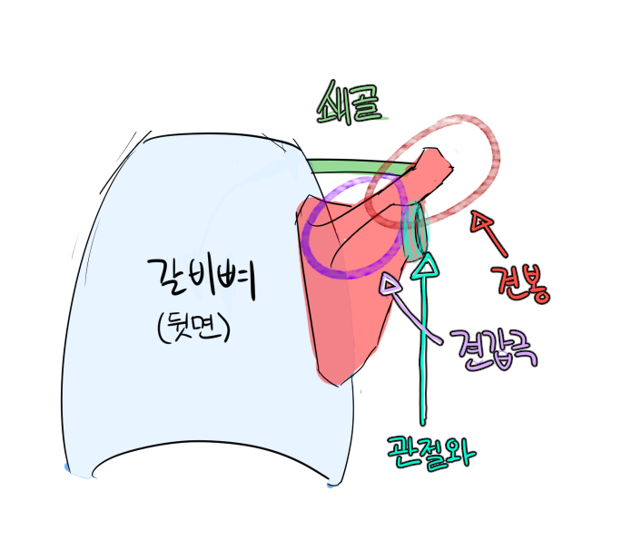

## 쇄골과 견갑골의 구조

### 일러두기

해부학에서 와는 주로 들어간 곳이나 구멍, 내지는 곡선에 가까운 곳을의마하고 극은 튀어나온 곳을 의미한다.

## 견갑골

> **견갑골**은 흔히 **날개뼈**라고 불리는 흉곽 뒤에 달려있는 뼈이다.

### 특징
날개뼈는 삼각형 형태의 평면이라 생각하기 쉽지만 숨겨진 구조가 더 있다

바로 견갑극인데 견갑극에 붙어있는 빗장(쇄골)과 이어지면서 팔의 운동을 안정화 시켜준다. 또한 팔은 날개뼈에 붙어있는 구조기에 관절와가 존재한다.

옆에서보면 등 라인을 따라 살짝 비스듬한 형태이다.

## 쇄골

> **빗장**뼈라고도 불리며 팔의 안정적인 운동을 돕는다.
> 

흉골(갈비의 중앙쪽)의 윗부분과 아까말한 견봉을 잇고있다.

견봉에 이어진 부분을 **견쇄관절**, 흉골과 이어진 부분을 **흉쇄관절**이라고 부른다.

### 특징

뭔가 극적으로 비스듬하게 있을 것 같지만 정면 기본자세에서 보면 생각보다 별로 안기울어져있다.

## 어깨와 쇄골의 운동 6가지

용어가 한자라 어렵지만 뜻풀이를 하면 생각보다 쉽다

- **거상**: 위로 올리기
- **하제**: 아래로 내리기
- **외전**: 바깥쪽(흉추)쪽으로 굽기
- **내전**: 안쪽(척추)쪽으로 펼치기
- **상방회전**(말 그대로)
- **하방회전**(말 그대로)