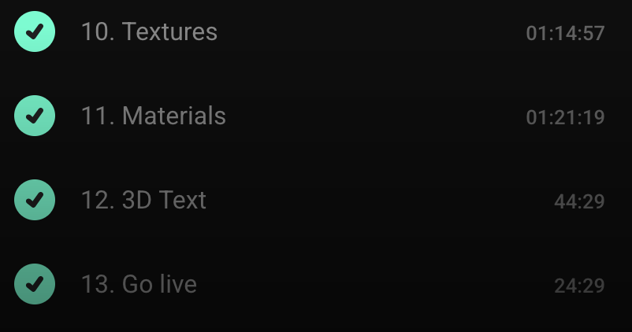

# TL;DR

Three.js Journey 약 10시간 분량의 챕터 1 강의를 다 들었음.
Three.js Journey #23 Train Challange를 나가면 파리에서 컨퍼런스를 들을 수 있다고 해서 참여해 볼 예정.
이번주는 아이디어 여러개를 나열하고 검증하는 단계를 거칠거임.

## 아이디어

이 중 고양이 카페의 기차 디오라마를 해보려고 함.

- 아시아 횡단열차
- 붕괴 스타레일 은하열차
- 은하철도 999
- 트롤리 딜레마
- 호그와트 열차
- 마인카트
- 롤러코스터
- 지하철 - 3호선 빌런
- 인도 기차
- 기차의 발전 과정
- 장갑기차
- 수동식 기차
- 토마스
- 고양이 카페의 기차 디오라마
- 앤트맨에 나온 장난감 기차
- 미국 화물열차를 기다리는 시간
- 일본 지하철에 사람 밀어넣기
  - 로 인해 발생한 사고
  - 사람을 효율적으로 구겨넣는 방법
