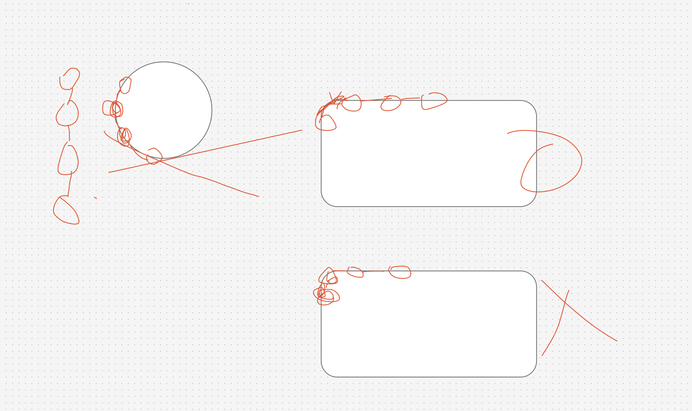

# TL;DR

어제 검증하기로 했던 고양이 카페의 기차 디오라마를 검증해봄.
먼저 가장 기본이 되는 기차 움직임 구현을 해봤음. 결론은 이 아이디어는 실현할 수 없음. 이유는 귀여운 고양이 에셋이 없음...

## 기차 움직임 구현


### 선로 만들기

[캣멀-롬 스플라인](https://lee-seokhyun.gitbook.io/game-programming/client/easy-mathematics/gdc2012/catmull-rom-splines)으로 각 지점을 톰과하는 곡선 선로를 만들어줌. 수학적 구현까지는 잘 모르겠지만, 선로를 만들 수 있었음.

### 객차별 움직임

기관차를 따라가는 객차별 움직임을 구현함.



객차는 기관차를 무조건적으로 따라가는게 아니라 현재 선로에 따라 방향과 위치를 조절해줘야함.

```ts
const t = (((trainT.current - offsets[i]) % 1) + 1) % 1;

railCurve.getPointAt(t, _pos.current);
railCurve.getTangentAt(t, _tangent.current).normalize();
_quat.current.setFromUnitVectors(_forward.current, _tangent.current);

group.position.copy(_pos.current);
group.quaternion.copy(_quat.current);
```

- 객차의 현재 위치 구하기: 캣멀-롬 스플라인이 0 ~ 1 사이로 곡선 상의 위치를 표현하기에
  getPoint로 선로에서 현재 벡터값을 가져올 수 있음.
- 객차의 현재 방향 구하기: 먼저 getTangent로 현재 위치의 접선을 가져옴. 그 다음 객차의 앞면에서 해당 접선으로 이동하기 위한 각도를 setFromUnitVectors로 구해줌. 이렇게 하면 매 프레임마다 객차가 회전하게 됨.

### 객차별 간격

이때 getPoint, getTangent를 사용하게 되면 객차 간의 간격이 일정하지 않고 곡선 구간에서 짧아지는 문제가 발생했음.
CatmullRomCurve3의 t 값은 실제 이동 거리가 아니라 구간 번호의 비율임. 예를 들어 직선 100m와 곡선 100m로 이루어진 선로가 있을 때, t=0.0~0.5는 직선 구간을, t=0.5~1.0은 곡선 구간을 담당함. 직선에서는 t가 조금만 변해도 멀리 가지만, 곡선에서는 t가 많이 변해도 조금밖에 못 감. 그래서 같은 t 간격으로 객차를 배치하면 곡선 구간에서 객차가 뭉치는 현상이 생김.

이를 해결하기 위해 getPointAt, getTangentAt으로 교체함. At은 "전체 선로 길이의 t 지점(at)에서"라는 의미로, 내부적으로 실제 선로 길이를 먼저 구한 뒤 "전체 길이의 몇 % 지점인가"를 기준으로 위치를 찾음. t=0.5라면 항상 전체 선로의 정확히 50% 거리 지점이 됨. 덕분에 곡선 구간과 직선 구간 모두 객차 간 간격이 균등하게 유지됨.

### 성능 최적화

[#5](https://github.com/Dino0204/Train-with-cat/issues/3?issue=Dino0204|Train-with-cat|5)

기존 파일이 500mb 정도되서 초기 로딩이 너무 느리고 실행 시 노트북이 버거워 했음. 그래서 블렌더에서 파일을 뜯어봤는데 약 300만개의 점이 있어서 Dedicate Modifier로 점을 10분의 1로 줄여줌. 이렇게 하니 파일 용량도 53mb 정도로 줄어들었음. 그래도 여전히 큰 수치를 가지고 있기 때문에 [Draco 압축](https://codelabs.developers.google.com/codelabs/draco-3d?hl=ko#0)을 통해 한번 더 용량을 줄여 6.4mb로 줄여줌.
