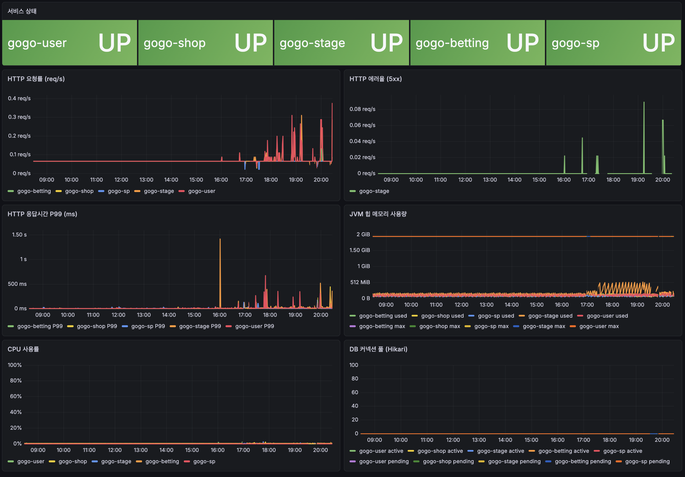
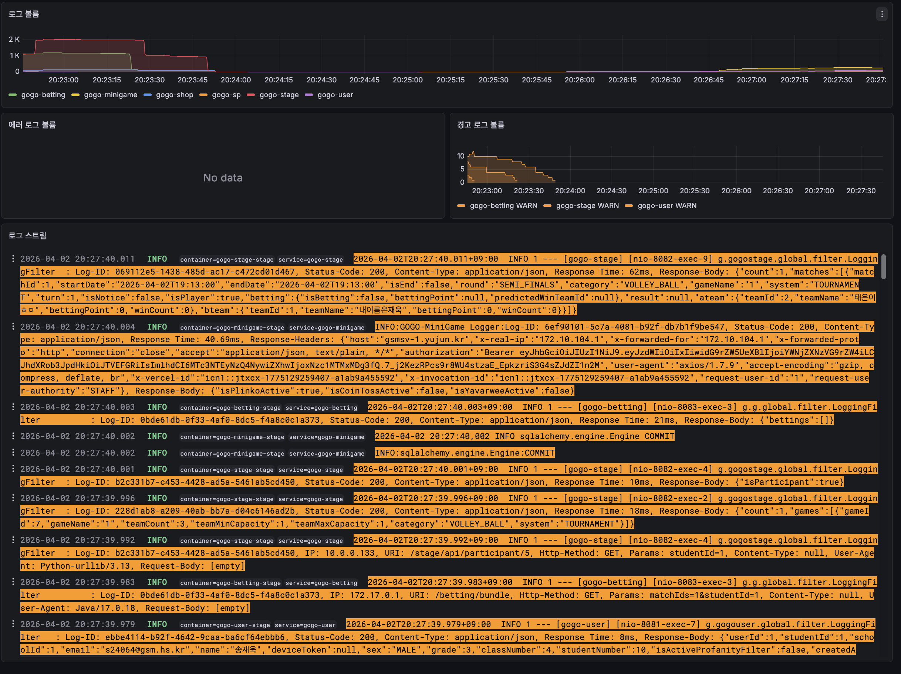
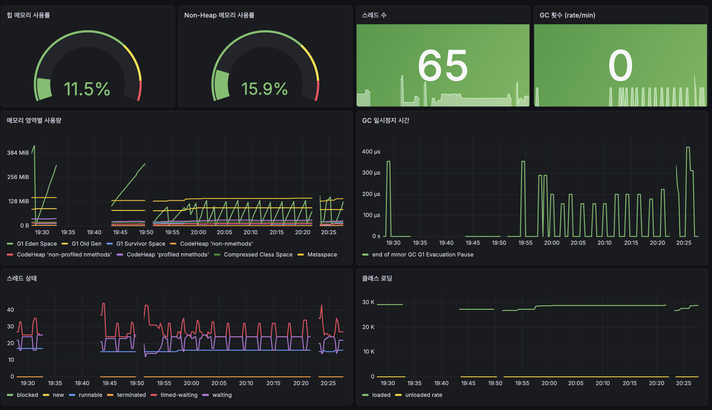
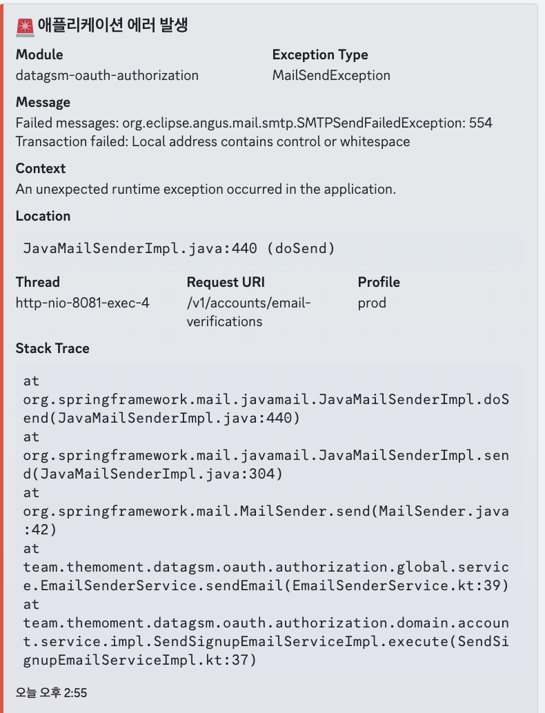

# 2026/04/01
### GOGO 이슈 해결
<table>
  <tr>
    <td align="center"></td>
    <td align="center"></td>
    <td align="center"></td>
  </tr>
</table>

- GOGO QA 중 미니게임 서버에서 422 발생 문제와 경기 조회 시 500 문제를 해결하기 위해 작업
- Eureka 서버에 서비스가 등록되지 않던 문제와 Kafka 브로커에 연결되지 못하던 문제를 수정함

### DataGSM 이메일 도메인 문제 수정

- AWS SES SMTP 554 문제가 발생하여 이메일 도메인을 새로 구입한 `datagsm.kr` 기반으로 변경하여 인증 문제를 해결함

### GSM 릴레이 스터디 연사 준비

- 바이브 코딩 관련 주제로 연사를 서기 위해 PPT를 준비하였음
