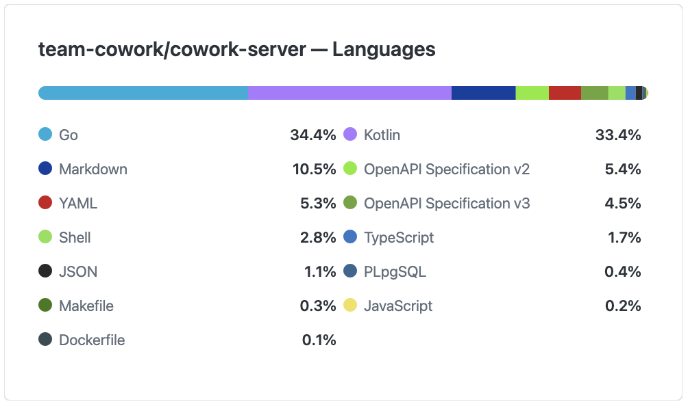

# 2026/04/20
### cowork Swagger 명세화 
- 통합된 경로로 Swagger OpenDoc API 명세를 제공하기 위해 각종 설정을 추가함.
### 레포지터리 세부 언어통계 위젯 개발
- https://github.com/snowykte0426/github-repository-language-graph-widget

- Vercel로 배포하였으며 간단하게 Node 기반 경량으로 개발함.
### GSM 릴레이스터디 연사 준비

- 익일 진행되는 GSM 릴레이스터디 [면접 준비 방법] 연사를 준비함.
- 연사 전 PPT 슬라이드 합 맞추기 작업 진행함.
### DataGSM 2주차 인수인계
- RFC 7636:  https://datatracker.ietf.org/doc/html/rfc7636
- RFC 6749: https://datatracker.ietf.org/doc/html/rfc6749
- RFC 7517: https://datatracker.ietf.org/doc/html/rfc7517
- 해당 기술표준과 이 기술표준이 어떻게 적용되었는지에 대해 스터디를 진행함.