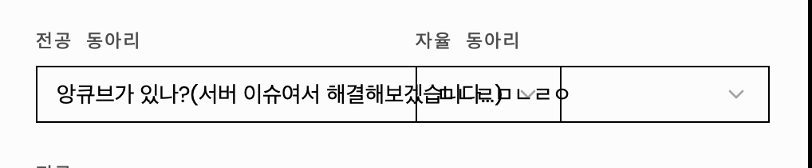
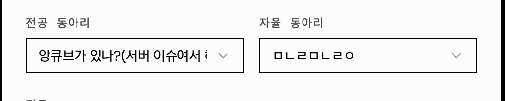
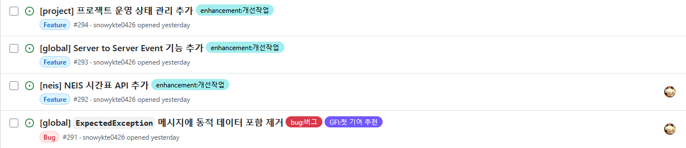

# 2026/04/03
### DataGSM 어드민 페이지 스타일 문제 해결
<table>
  <tr>
    <td align="center"></td>
    <td align="center"></td>
  </tr>
</table>

- DataGSM 어드민 페이지에서 학생 데이터 수정 다이얼로그에 스타일 문제가 발생함
- 전공동아리/자율동아리의 이름이 너무 길면 셀렉트 트리거의 넓이가 제한되지 않고 계속 넓어지는 문제가 있어 이를 수정함

### DataGSM 비활성 Hook 제거
- 트리거는 되지만 무의미한 작업을 진행하던 Hook 스크립트 파일을 제거하였음
- https://github.com/themoment-team/datagsm-server/pull/290

### DataGSM 신규 기능 및 개선점 파악

- DataGSM 서버에서 개선점 및 추가 기능을 고민하고 논의하기 위해 Issue로 등록함
- https://github.com/themoment-team/datagsm-server/issues/291
- https://github.com/themoment-team/datagsm-server/issues/292
- https://github.com/themoment-team/datagsm-server/issues/293
- https://github.com/themoment-team/datagsm-server/issues/294
