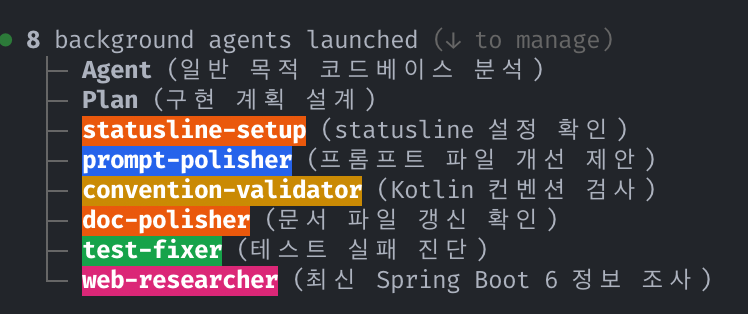

# 2026/04/05
### LLM 하네스 공부
- Claude Code가 `AskUserQuestion` 도구를 적극적으로 활용하도록 프롬프트을 개선함
- 각종 서브 에이전트를 정의하고 상황에 따라 적절히 사용되도록 정의함
- https://github.com/themoment-team/datagsm-server/pull/298
https://github.com/themoment-team/datagsm-server/pull/299
https://github.com/themoment-team/datagsm-server/pull/300

