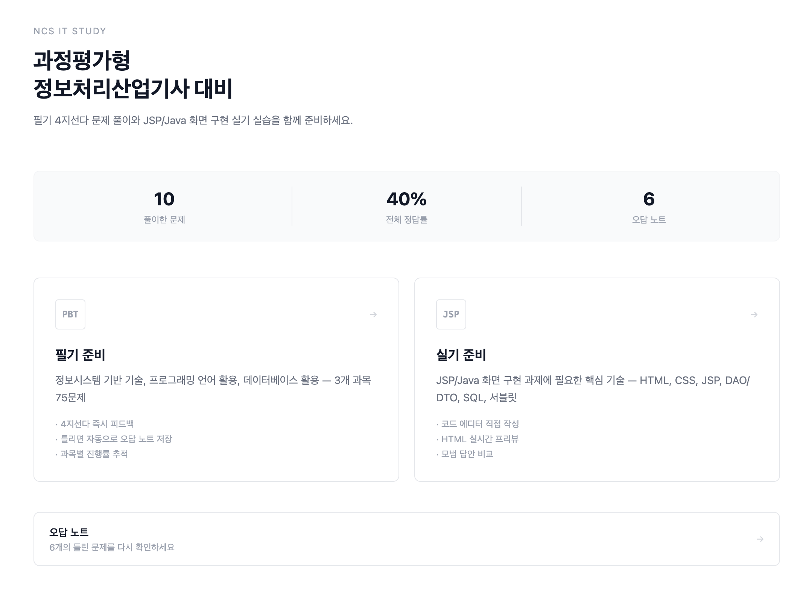

# 2026/04/07
### DataGSM NEIS 시간표 데이터 연동 기능 만들기
- https://github.com/themoment-team/datagsm-server/pull/306
- https://github.com/themoment-team/datagsm-front/pull/147
- 기존 급식/학사일정 데이터와 더불어서 시간표 데이터 역시 시스템의 관리 하로 편입함.
### 과정평가형 정보처리산업기사 웹사이트 만들기

- 과정평가형 정보처리산업기사에 대비할 수 있는 웹사이트를 만듬
