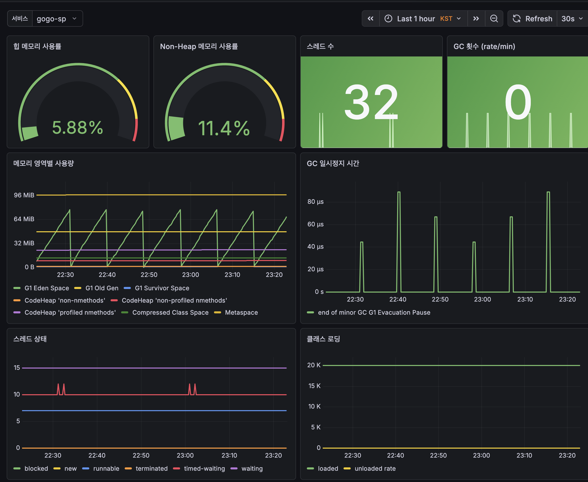
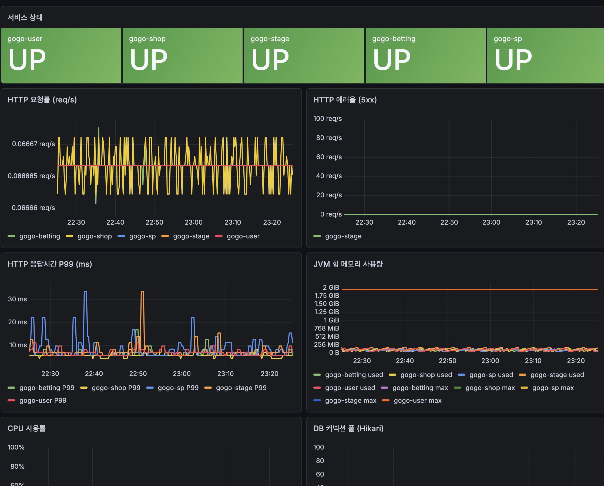
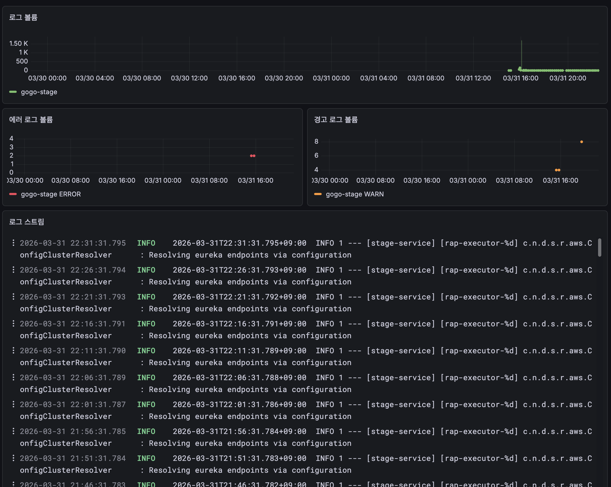
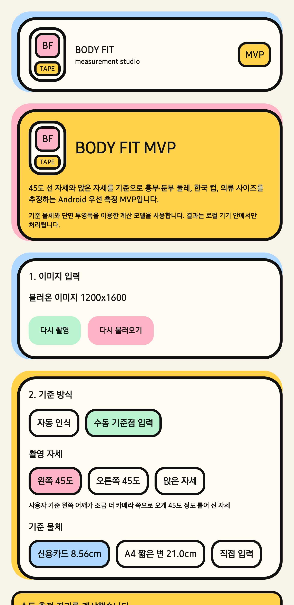
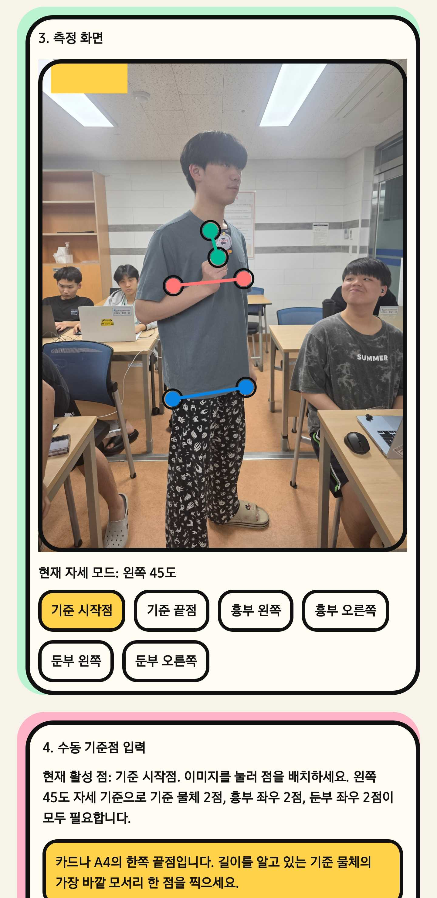
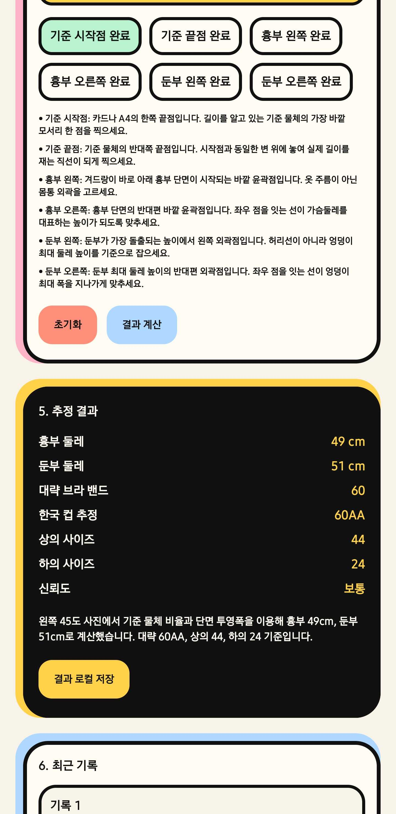

# 2026/03/31
### GOGO 서버 배포
<table>
  <tr>
    <td align="center"></td>
    <td align="center"></td>
    <td align="center"></td>
  </tr>
</table>

- MSA 기반 서비스를 학교서버(GSM SV)에 배포함
- Grafana 대시보드 구성
### KMP 공부
- Kotlin 한가지 언어로 Android,iOS,Web,Warch OS 등의 여러가지 플랫폼을 동시에 개발 가능한 프레임워크
- 사진을 찍어 피사체의 의류 사이즈를 구해주는 앱을 만들어봄
<table>
  <tr>
    <td align="center"></td>
    <td align="center"></td>
    <td align="center"></td>
  </tr>
</table>

### DataGSM SDK 수정
- 주로 변경된 DataGSM Base URL 반영 작업을 진행함
- https://github.com/themoment-team/datagsm-openapi-sdk-java/pull/12
- https://github.com/themoment-team/datagsm-openapi-sdk-python/pull/4
- https://github.com/themoment-team/datagsm-oauth-sdk-react/pull/5
### EveryGSM v2 상용환경 도메인 발급
- `datagsm.kr` 도메인 기반의 EveryGSM v2 서버를 위한 도메인 인증 및 연결작업을 수행함
